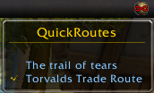

# QuickRoutes (WoW AddOn)

&nbsp; &nbsp; &nbsp; &nbsp;

## Description
**You have create some routes for the same zone in Routes and now a little bit confused about too many lines?**

Any created route in Routes can be hide. QuickRoutes is a shotcut to this option. This addon offer you a clickable list of your created routes depending on your current location/zone. *(see example image)*

## It has two option to access the tooltip:

* Minimap Icon/Button (optional, default visible)
* DataBroker display addons

## DataBroker display addons?

You can use panel-addons like [Bazooka](https://www.curseforge.com/wow/addons/bazooka), [ChocolateBar](https://www.curseforge.com/wow/addons/chocolatebar), [DockingStation](https://www.wowinterface.com/downloads/info11831-DockingStationDisplay.html), [NinjaPanel](https://www.curseforge.com/wow/addons/ninjapanel), [TitanPanel](https://www.curseforge.com/wow/addons/titan-panel) or single-button-addons like [Fortress]() *abandoned*, [StatBlockCore](https://www.wowace.com/addons/fortress/).

## Bug reports, feature requests and Support
* [Bug reports & feature requests on Github](https://github.com/HizurosWoWAddOns/QuickRoutes/issues)
* [Comments & Criticism on Curseforge](https://www.curseforge.com/wow/addons/quickroutes)

## Localization
Do you want to help translate this addon?
See [Curseforge localization tool](https://www.curseforge.com/wow/addons/#/localization)

## Hizuro's projects
* On [Curseforge](https://www.curseforge.com/members/hizuro_de/projects)
* On [Github](https://github.com/HizurosWoWAddOns)

## Disclaimer
> World of Warcraft© and Blizzard Entertainment© are all trademarks or registered trademarks of Blizzard Entertainment in the United States and/or other countries. These terms and all related materials, logos, and images are copyright © Blizzard Entertainment.
